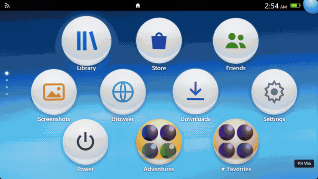

# Bender Themes · Deck Home Themes

Console-inspired home screens and cinematic interfaces for Steam Deck, built as a Decky Loader plugin.



[Watch the MP4 showcase](docs/showcase.mp4) · [Download the latest installation ZIP](https://github.com/Kaal31/benderthemes/releases/latest)

The showcase records the actual browser previews with sample games. It demonstrates appearance and animation; it is not footage captured on a Steam Deck.

## Themes

| Collection | Included styles |
| --- | --- |
| PlayStation | PS Vita bubbles, PS2 browser, PS3 XMB, PSP XMB, PS4 and PS5 |
| Xbox | Original Xbox, Xbox 360 Blades, NXE, Kinect and Metro |
| Bonus | Aero, Alien Dial, Floating Castle and Republic Office |

Switch presets from the plugin's Quick Access panel or the home screen options menu. Console presets are grouped by company. Imported Vita skins and PS3 themes can add further presets.

- **PS2:** orbiting blue lights, silver-gray memory-card browser, dimensional save icons and a soft selection spotlight.
- **Vita:** glossy bubbles, adjustable sway, folders, collections and LiveArea.
- **Xbox:** reconstructed dashboard assets, themed categories, clock and interface sounds; four Xbox 360 generations.
- **Aero:** blue glass panels, vivid lime highlights and a sky-and-hills backdrop.
- **Alien Dial:** multiple dial colors, matching holographic covers, optional floating covers and projection light, and selectable animation combinations.
- **Floating Castle:** looping video wallpaper, glass windows, animated circular navigation, replace-or-layer secondary windows, and optional automatic-location weather in Celsius.
- **Republic Office:** looping city wallpaper, Aurebesh text, readable stylized navigation, a rotating golden emblem, blue holographic displays, Battlefront menu effects and background music.

Theme settings include supported cover treatments, reflections, motion controls and TV presentation. The global background-music switch silences theme music independently of interface sounds. Theme-owned library, store and other panels retain their theme's presentation. Some system operations still depend on Steam and Decky.

## Install

1. Install and enable Decky Loader on your Steam Deck.
2. Download **DeckHomeThemes-v1.9.3.zip** from the Releases page and copy it to your Deck.
3. Enable Decky's developer options, then use **Install Plugin from ZIP** to select the archive.
4. Open **Deck Home Themes** in Quick Access and choose a preset.

This ZIP includes the compiled plugin, wallpapers, video backgrounds, sound packs and theme resources. Do not use GitHub's automatic source ZIP as the install package.

## Build from source

Requires Node.js with npm and Python 3.

```sh
npm ci
npm run typecheck
npm run build
npm run package
```

The installable archive is written to `out/DeckHomeThemes-v1.9.3.zip`. Packaging is self-contained: it does not require an older release ZIP.

For browser previews:

```sh
npm run preview
python -m http.server 8766
```

Open `http://127.0.0.1:8766/preview/preview.html`, or the generated `dial-preview.html`, `aero-preview.html`, `castle-preview.html` and `republic-preview.html` in the same directory. Previews use sample games and mock Steam services; they do not launch real games. Playwright checks are in `tests/` and use this preview server.

## Current limits

This release has browser-preview, type-check and build validation. Native Steam Deck behavior, controller integration and performance across all hardware configurations still need on-device testing. These are console-inspired reconstructions, not original console software or a claim of exact visual parity.

Castle weather is opt-in and uses IP-based approximate location through ipwho.is and current conditions from Open-Meteo. Network failure shows an unavailable state. The Cardinal System address in the castle header is a sample address. Video backgrounds are 720p; motion can be disabled.

## Credits

Special thanks to **[justinca92 — SpinDeck](https://github.com/justinca92/spindeck)** for inspiring this plugin. SpinDeck's implementation was one of the reference projects supplied during AI-assisted development and helped make this project possible.

The following projects, creators and resources were also supplied as references or asset sources during AI-assisted development:

| Project or resource | Contribution |
| --- | --- |
| [EldeBH — Classic Battlefront Menu SFX](https://www.nexusmods.com/starwarsbattlefront22017/mods/2673?tab=description) | Menu sound effects for the Republic Office theme |
| [DeckThemes](https://deckthemes.com/) | Audio assets and sound packs |
| [MrMilenko — Theseus](https://github.com/MrMilenko/Theseus) | Original Xbox dashboard reference and assets |
| [Fabxx — XBMC360](https://github.com/Fabxx/XBMC360) | Xbox 360 Blades reference and assets |
| DeviantArt creators and other PSP references | Icons and visual references for the PSP theme |
| [Libretro — RetroArch](https://github.com/libretro/retroarch) | Interface assets and icons |
| [Saud's PS2-inspired browser](https://www.imsaud.me/browser) | Visual reference for the PS2 interface |
| [Warren Uhrich — SAO UI](https://warrenuhrich.github.io/SAO-UI/) | Animation reference for the Floating Castle / SAO interface |

Bundled resources include third-party theme materials, fonts, sounds and reconstruction references. Their existing notices are retained in [third-party/](third-party/) and resource-level `SOURCES.txt` files. Original Deck Home Themes attribution is preserved in [Original-Deck-Home-Themes-BSD.txt](third-party/Original-Deck-Home-Themes-BSD.txt).

No project-wide license is added by this repository.
