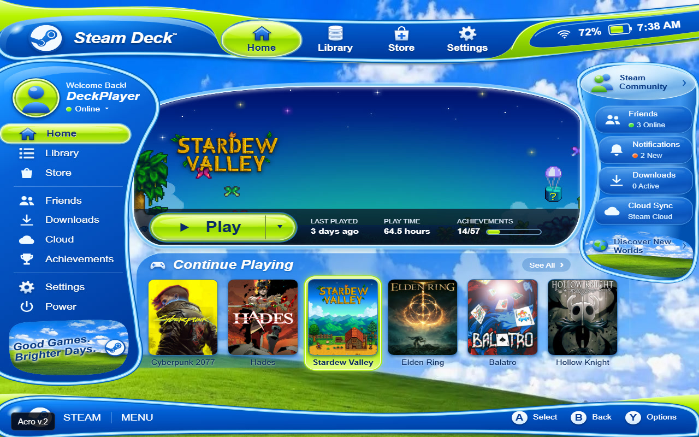
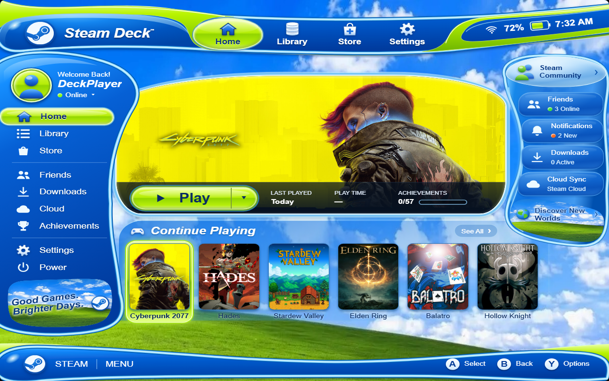
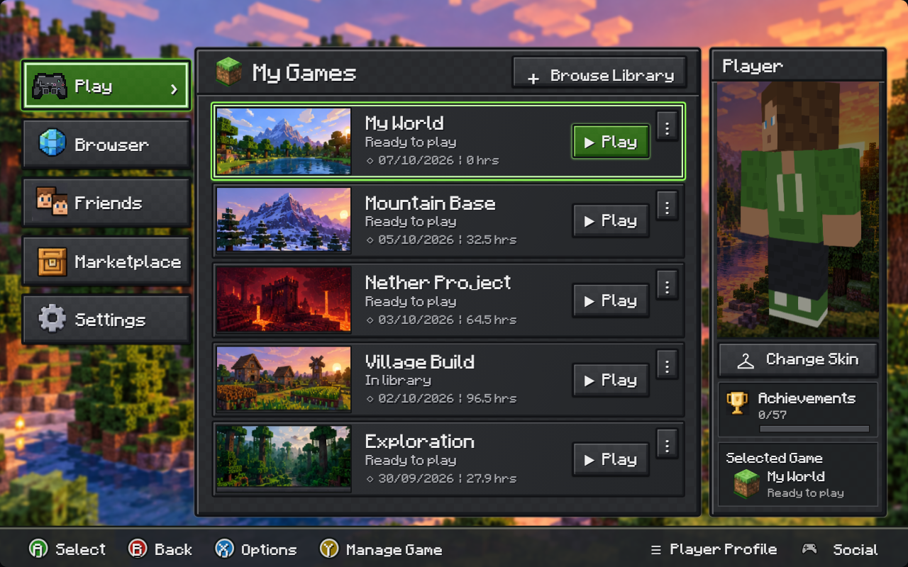
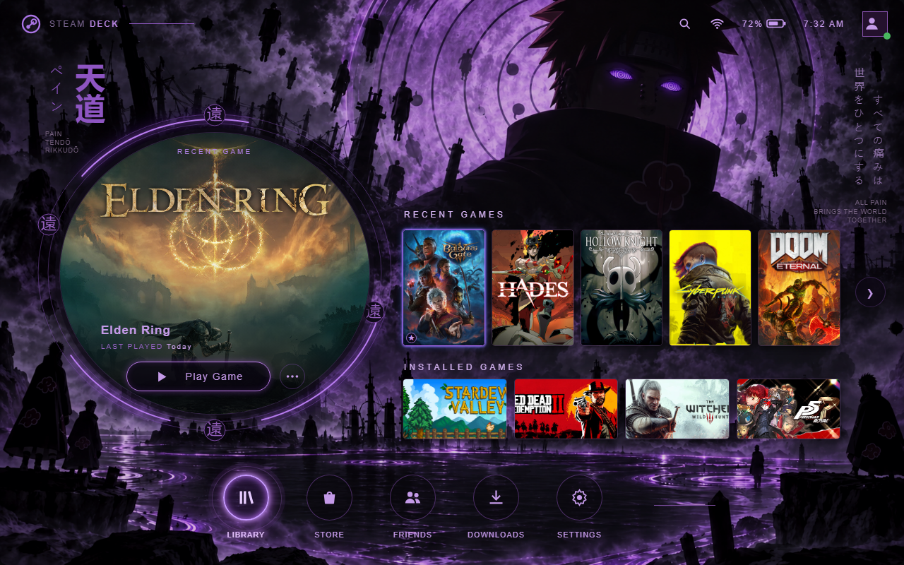

# Bender Themes · Deck Home Themes

Console-inspired home screens and cinematic interfaces for Steam Deck, built as a Decky Loader plugin.

**Version 1.10.0:** plugin updates, themed firmware notifications, Hub with
individual theme downloads, and collection selection in every theme's options
menu. Preferences and installed themes persist through future updates/reinstalls.
Delete and hide individual themes from their options menu.

**Upgrading from before 1.10.0?** Old builds delete settings during replacement.
This first upgrade starts fresh; no migration helper is needed.
[Upgrade and Hub guide](docs/UPDATES.md).

[](https://github.com/Kaal31/benderthemes/raw/refs/heads/main/docs/showcase.mp4)

[Watch the full UI walkthrough (MP4)](https://github.com/Kaal31/benderthemes/raw/refs/heads/main/docs/showcase.mp4) · [Download the latest installation ZIP](https://github.com/Kaal31/benderthemes/releases/latest)

The video demonstrates navigation, selection changes and options across every theme, including all four Xbox 360 dashboards, using real game covers. It records the browser previews with a sample library, not a Steam Deck. The demonstration is silent. [View theme timestamps](docs/showcase-chapters.md).

## Themes

| Collection | Included styles |
| --- | --- |
| PlayStation | PS Vita bubbles, PS2 browser, PS3 XMB, PSP XMB, PS4 and PS5 |
| Xbox | Original Xbox, Xbox 360 Blades, NXE, Kinect and Metro |
| Bonus | Aero, Aero v.2, Alien Dial, Floating Castle, Republic Office, Block Worlds, Six Paths and Nazarick |

Switch presets from the plugin's Quick Access panel or the home screen options menu. Console presets are grouped by company. Imported Vita skins and PS3 themes can add further presets.

- **PS2:** orbiting blue lights, silver-gray memory-card browser, dimensional save icons and a soft selection spotlight.
- **Vita:** glossy bubbles, adjustable sway, folders, collections and LiveArea.
- **Xbox:** reconstructed dashboard assets, themed categories, clock and interface sounds; four Xbox 360 generations.
- **Aero / Aero v.2:** blue glass panels, vivid lime highlights and a sky-and-hills backdrop.
- **Alien Dial:** multiple dial colors, matching holographic covers, optional floating covers and projection light, and selectable animation combinations.
- **Floating Castle:** looping video wallpaper, glass windows, animated circular navigation, replace-or-layer secondary windows, and optional automatic-location weather in Celsius.
- **Nazarick:** ornate gold and violet home screen, circular navigation, live featured game, and six category wallpapers: Ainz’s throne room, Demiurge’s library, Pandora’s treasury, Aura and Mare’s garden, Sebas’s receiving hall and Albedo’s study.
- **Republic Office:** looping city wallpaper, Aurebesh text, readable stylized navigation, a rotating golden emblem, blue holographic displays, Battlefront menu effects and background music.

Theme settings include supported cover treatments, reflections, motion controls and TV presentation. The global background-music switch silences theme music independently of interface sounds. Theme-owned library, store and other panels retain their theme's presentation. Some system operations still depend on Steam and Decky.

## Install

1. Install and enable Decky Loader on your Steam Deck.
2. Download the latest **DeckHomeThemes-vX.Y.Z.zip** from the Releases page and copy it to your Deck.
3. Enable Decky's developer options, then use **Install Plugin from ZIP** to select the archive.
4. Open **Deck Home Themes** in Quick Access and choose a preset.

This ZIP includes the compiled plugin, wallpapers, video backgrounds, sound packs and theme resources. Do not use GitHub's automatic source ZIP as the install package.

## Build from source

Requires Node.js with npm and Python 3.

```sh
npm ci
npm run typecheck
npm run build
npm run package
```

The installable archive is written to `out/DeckHomeThemes-v<version>.zip`. Packaging is self-contained: it does not require an older release ZIP.

For browser previews:

```sh
npm run preview
python -m http.server 8766
```

Open `http://127.0.0.1:8766/preview/preview.html`, or the generated `dial-preview.html`, `aero-preview.html`, `aero2-preview.html`, `castle-preview.html`, `republic-preview.html`, `minecraft-preview.html` `pain-preview.html` and `nazarick-preview.html` in the same directory. Previews use sample games and mock Steam services; they do not launch real games. Playwright checks are in `tests/` and use this preview server.

## Numbered releases

Every source push to `main` is checked, built and packaged by GitHub Actions. Successful builds publish a new numbered release (starting with v1.9.6); the patch version advances automatically. Each release keeps its own ZIP and source tag. Failed checks do not publish a release. The workflow can also be started manually from Actions.

## Latest additions

- Nazarick plays “No Man’s Dawn” (instrumental); Floating Castle plays Half Ghoul Music’s “Crossing Fields” instrumental remix. Six Paths plays “Girei” (Pain’s Theme Song). All three follow the existing global/theme music switches and music volume.

- Styled loading screens for every theme, including Xbox 360 variants and Alien Dial colors. Steam and non-Steam games share the same launch handling.
- Smooth page handoffs, preloaded Nazarick wallpapers, persistent Nazarick navigation, and ornate secondary windows.

- Nazarick theme and six generated wallpapers based on the supplied visual reference.
- Blades options menu can open from the left or right.
- Block Worlds sidebar uses transparent pixel icons.
- Six Paths shows a clean game name when logo art is missing; orbit symbols use vector strokes.
- Republic controls and settings use readable Aurebesh-style English.
- Alien Dial skins share all switch animations and restart activation when the skin changes.

## New in v1.9.6

- **Block Worlds:** Minecraft-inspired library, live 3D player, skin painting/import/export/randomization, focus-following gaze, arm strikes and touch rotation. Browser opens minecraft.net.
- **Aero v.2:** a separate preset with sculpted panels, integrated landscape sections and revised blue gloss. Original Aero remains available.
- **Six Paths:** purple moonlit home, circular selected-game display, recent/installed rows, matching menus and smooth motion. The circle follows selection and labels its source section.
- **Alien Dial:** optional slower hourglass-to-rhombus morph with a 650 ms hold.
- **Audio:** Minecraft Console Legacy effects, C418’s Sweden background music, and Windows XP effects for both Aero versions; existing audio controls apply.
- **Fix:** company selection persists and the preset dropdown stays valid when switching between Sony, Microsoft and Bonus.

## Current limits

This release has browser-preview, type-check and build validation. Native Steam Deck behavior, controller integration and performance across all hardware configurations still need on-device testing. These are console-inspired reconstructions, not original console software or a claim of exact visual parity.

Castle weather is opt-in and uses IP-based approximate location through ipwho.is and current conditions from Open-Meteo. Network failure shows an unavailable state. The Cardinal System address in the castle header is a sample address. Video backgrounds are 720p; motion can be disabled.

## Additional theme previews





The video above includes these additions. These screenshots are browser previews with sample games.

## Credits

Special thanks to **[justinca92 — SpinDeck](https://github.com/justinca92/spindeck)** for inspiring this plugin. SpinDeck's implementation was one of the reference projects supplied during AI-assisted development and helped make this project possible.

The following projects, creators and resources were also supplied as references or asset sources during AI-assisted development:

| Project or resource | Contribution |
| --- | --- |
| [EldeBH — Classic Battlefront Menu SFX](https://www.nexusmods.com/starwarsbattlefront22017/mods/2673?tab=description) | Menu sound effects for the Republic Office theme |
| [DeckThemes](https://deckthemes.com/) | Audio assets and sound packs |
| [MrMilenko — Theseus](https://github.com/MrMilenko/Theseus) | Original Xbox dashboard reference and assets |
| [Fabxx — XBMC360](https://github.com/Fabxx/XBMC360) | Xbox 360 Blades reference and assets |
| DeviantArt creators and other PSP references | Icons and visual references for the PSP theme |
| [Libretro — RetroArch Assets](https://github.com/libretro/retroarch-assets) | Interface assets and icons |
| [kmturley — Cover Forge](https://github.com/kmturley/cover-forge) | Reference for dimensional game cases, printed sleeves, spines and glossy surfaces |
| [TheRensei — SteamDeckCSSThemes](https://github.com/TheRensei/SteamDeckCSSThemes/tree/main/Game%20Cover%20Reflections%20Theme) | Game-cover reflection reference |
| [Aurek Fonts](https://github.com/AurekFonts/AurekFonts.github.io) | Aurebesh AF and readable Aurebesh English fonts for Republic Office |
| [bs-community — skinview3d](https://github.com/bs-community/skinview3d) | Live Minecraft player renderer, with skinview-utils and Three.js; bundled notices retained |
| [South-Paw — typeface-minecraft](https://github.com/South-Paw/typeface-minecraft) | Minecraft-style typeface |
| Gecked#0108 — Minecraft Console Legacy | User-supplied Minecraft menu sound pack |
| cadecomposer — windows xp sounds | User-supplied Aero menu sound pack |
| Girei (Pain’s Theme Song) — Action X Now recording | User-supplied Six Paths background music |
| Mayu Maeshima — No Man’s Dawn (instrumental) | User-supplied Nazarick background music |
| Half Ghoul Music — Crossing Fields (Instrumental Remix) | User-supplied Floating Castle background music |
| C418 — Sweden, Minecraft Volume Alpha | User-supplied Block Worlds background music |
| [Simple Icons](https://github.com/simple-icons/simple-icons) | Steam icon artwork |
| [vgmstream](https://github.com/vgmstream/vgmstream) | Tool used to decode the supplied Battlefront sound assets |
| [Cinzel](https://github.com/NDISCOVER/Cinzel) and [Cormorant](https://github.com/CatharsisFonts/Cormorant) | Republic title and text font resources |
| [Saud's PS2-inspired browser](https://www.imsaud.me/browser) | Visual reference for the PS2 interface |
| [Warren Uhrich — SAO UI](https://warrenuhrich.github.io/SAO-UI/) | Animation reference for the Floating Castle / SAO interface |

Additional repositories supplied as development references include [VitauMX/vita-ui](https://github.com/VitauMX/vita-ui) for Vita presentation, [uofw/uofw](https://github.com/uofw/uofw) for PSP research, and [seatann-dev/decky-wall](https://github.com/seatann-dev/decky-wall) for video-wallpaper ideas. These acknowledgements identify references supplied during development; they do not imply that their code is bundled.

The plugin runs on [SteamDeckHomebrew/Decky Loader](https://github.com/SteamDeckHomebrew/decky-loader). Cover Forge inspired the lightweight CSS 3D case implementation; its complete renderer is not included.

Bundled resources include third-party theme materials, fonts, sounds and reconstruction references. Their existing notices are retained in [third-party/](third-party/) and resource-level `SOURCES.txt` files. Original Deck Home Themes attribution is preserved in [Original-Deck-Home-Themes-BSD.txt](third-party/Original-Deck-Home-Themes-BSD.txt).

No project-wide license is added by this repository.

### Nazarick artwork

The six bundled category wallpapers were generated from the user’s supplied visual reference with the built-in image-generation tool. Overlord characters and setting belong to their respective rights holders. [Artwork generation notes](docs/nazarick-artwork.md).
